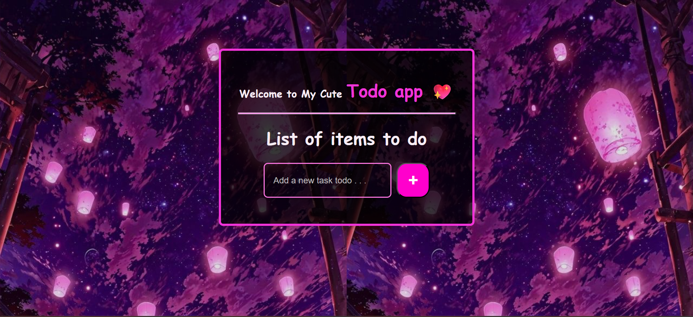

# ✅ React + TypeScript Todo List App

A simple and elegant **Todo List** application built with **React** and **TypeScript**. This app allows users to add, edit, delete, and mark tasks as complete, with a clean and modern UI.

## 🚀 Features

- 📌 Add new tasks
- ✅ Mark tasks as completed (checkbox with strikethrough)
- 📝 Edit existing tasks
- ❌ Delete tasks
- 🎨 Custom styled using CSS and icons
- ⚛️ Built with reusable React components
- 💡 Written in TypeScript for better type safety

## 🧩 Tech Stack

- [React](https://reactjs.org/)
- [TypeScript](https://www.typescriptlang.org/)
- [Vite](https://vitejs.dev/) (or CRA if you used Create React App)
- CSS (optionally with Tailwind or custom styles)
- React Hooks (`useState`, `useEffect`)
- Icons (e.g., `react-icons`)

## 📁 Folder Structure

src/
│
├── components/
│ ├── TodoForm.tsx
│ ├── TodoItem.tsx
│ ├── Checkbox.tsx
│ ├── EditButton.tsx
│ └── DeleteButton.tsx
│
├── types/
│ └── Todo.ts
│
├── App.tsx
├── index.tsx
├── index.css
└── App.css
# 📸 Preview
### 1. No task available
before the tasks are added:

### 2. Add task
Type a task into the input field and click "+ Add Task".
The task will be added to your list.

### 3. Edit task
To update a task, click the Edit button.
A popup will let you change the task text.

### 4. Complete task
Click the checkbox beside a task to mark it as completed.
Completed tasks appear with a line-through style or a different color.

